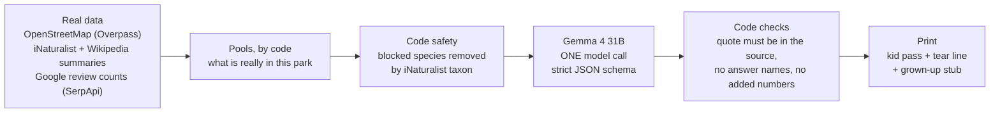

# Grass Pass: your ticket to get outside

> Pick a park. Print a pass. Phone away.

**Try it live:** TODO (PM): put the production URL here at deploy (Fri Oct 9). No login.

TODO (PM): put one screenshot of a real pass here (the Arbor Hills example, with its date).

Grass Pass makes a one-page, printable scavenger pass for a real park and a child's age (4-6, 6-10 or 10-13). The
goal is about **30 seconds on a screen**: pick a park, pick an age, print. Then the phone goes away. The child ticks
boxes with a pencil, and the grown-up keeps a tear-off stub with the answers, safety notes and sources.

Every item on a pass is backed by real, dated data about **that** park:
- **Park Finds:** what is mapped inside the park on OpenStreetMap (courts, playgrounds, shelters, bridges, ponds...).
- **Wild Finds:** species people photographed within 1.5 km in the last 14 days (iNaturalist, research grade only).
- **Find This Spot:** a black-and-white map of the park's paths with an X on one real landmark, drawn by code.
- **Lucky Finds:** "maybe" finds (a dog out for a walk, someone on a bike), only when at least 3 Google visitor
  reviews of that park from the last 2 years mention them. Code counts the reviews through SerpApi; review text is
  never shown or sent to the AI.
- **October special:** real monarch butterfly counts near the park, next to the same days last year.

An open-weight model (**Gemma 4**, Apache-2.0) picks a fair mix for each park and writes kid-level clues. Code checks
every clue against its source and decides what is safe. If a source has nothing, the pass says **"No data
available"** and why. It never pads the pass with generic items.

Built for the DEV Hacktoberfest 2026 Open-Source AI Challenge, Week 1 "Touch Grass".

## Live demo
Live demo: (link added at deploy, Fri Oct 9)

No login, no account. To try it:
1. On the home page, tap one of the **example parks** (for example Arbor Hills Nature Preserve, the first one). Its pass
   for today is already made, so it opens right away.
2. Press **Print pass** (at the top of the pass page). One Letter page: the kid's pass on top, the grown-up's stub below.
3. To make your own: search a park by name (for example "Connemara Meadow Preserve") or a town, pick a park from the
   list, pick an age band and press **Make my pass**. A new pass usually takes 10-30 seconds, and up to about a minute and a half when the free map servers are slow.

A town search lists the **10 nearest** named parks within 5 km, so a park you know may not be in the list for a town
search (for example "Allen TX" lists 10 of its 53 nearby parks, and Connemara is not one of them). Search the park's
own name instead, or use "Use my location".

## How it works
The app has its own **How it works** page (`/how-it-works`, the "How it works" tab at the top of every page): every
step with a diagram, what the model is and isn't given, every reason a clue is removed in plain words, the refill
rules, caching and limits, the measured numbers and the honest limits. The short version:



1. **You pick a park.** Typed text goes to Nominatim (OpenStreetMap search); nearby parks come from the Overpass API.
2. **Code collects real facts** for the park: mapped features (Overpass) and recent sightings with their Wikipedia
   summaries (iNaturalist). From Sep 15 to Nov 15 it also counts monarchs near the park. For Lucky Finds it finds
   the same park on Google Maps (SerpApi `google_maps`: the name must match, within 1 km of the map centre, and be a
   park, not a court inside it), then counts the reviews from the last 24 months whose own text mentions dogs, bikes,
   and ducks (parks with a pond) or skateboards (SerpApi `google_maps_reviews`, newest first, up to 3 searches). A
   keyword needs 3 or more. Only the word, the count and the newest month go into the pool; the counts are kept 30 days.
3. **Code decides what is safe.** Venomous snakes, recluse and widow spiders, fire ants, poison ivy and the other
   blocked groups in `src/lib/safety/danger-taxa.ts` are removed by iNaturalist taxon id and ancestor ids before the
   model sees the list, and checked again after. Every Wild Find gets a fixed "look, don't touch" line from code.
4. **One call to an open model** (`gemma-4-31B-it` on DigitalOcean serverless inference by default) picks items by
   id and writes the clues. The JSON schema allows only the real pool ids.
5. **Code checks every clue.** Its `sourceQuote` must appear word for word in that item's source; it must not name
   its answer, add a number or contain a link, a "how many" question must not give its own number, and a "listen"
   clue is only allowed for something its source says makes a sound (never a plant, fungus, butterfly or dragonfly).
   A failing clue is dropped, never rewritten. The only edits code makes: it takes a filler opener ("Quick!",
   "Psst,") off the front, and turns the "?" after a command ("Track 3 fields?") into a full stop. Too few left: one
   retry.
   Every number and date on the pass is written by code, and the pass names the model that actually answered.
6. **You print it.** Black and white, one Letter page (A4 works too).

Passes are cached per park, age band and day (Chicago time), so the same park is instant for the next visitor.
Per-IP limits and daily caps protect the free model budget and the free public map servers.

## Quick start
Needs Node 22 and pnpm.

```bash
pnpm install
cp .env.example .env.local   # add DO_INFERENCE_API_KEY, or point MODEL_BASE_URL at a local Ollama
pnpm dev                     # http://localhost:3000
```

Every environment variable is explained in [`.env.example`](.env.example). Keys are server-only. Lucky Finds need
`SERPAPI_API_KEY` (a free SerpApi account); `SERPAPI_DAILY_CAP` and `SERPAPI_MONTHLY_CAP` cap the searches. Without
`UPSTASH_REDIS_REST_URL`/`_TOKEN`, caches and limits live in memory (fine locally). Without a model key, park search
still works and a new pass says the model is not configured.

| Script | What it does |
|---|---|
| `pnpm lint` | ESLint, zero warnings allowed |
| `pnpm typecheck` | `next typegen && tsc --noEmit` |
| `pnpm test` | Vitest unit tests (recorded real API answers, no network) |
| `pnpm build` / `pnpm start` | production build / server |
| `pnpm e2e` | Playwright against `pnpm start` (port 3123, or `E2E_BASE_URL`). Live tests skip honestly, with the server's error code, when an upstream or a limit says no |
| `pnpm osm:snapshot` | re-records the saved OpenStreetMap data from live Overpass: map data for the 4 example parks and the Dallas-area park list used when Overpass is down (`src/data/osm/`) |
| `pnpm eval` | the evals: 20 recorded real parks, live open models on DigitalOcean (about $0.05-0.06, capped at $1), plus a no-AI baseline. See [`evals/README.md`](evals/README.md) |
| `pnpm eval:check` | free dry run of every recorded park through the real pass builder, model off |
| `pnpm eval:record` | re-records the 20 eval parks live from OpenStreetMap and iNaturalist |
| `node scripts/render-brand.mjs` | re-renders every logo, icon and share image from `scripts/brand/art.mjs` (printed pass logo) and `scripts/brand/v3.mjs` (v3 icons and share images) |

### Cold start (measured)
Measured on Oct 5, 2026 (~11:15 PM CDT) on the build laptop (Windows 11, Node 22), from a fresh git worktree:
- `pnpm build` with no `.next` cache: **17.2 s** (Next.js 16.3.8, Turbopack).
- `next start`, fresh process, empty in-memory store: first `GET /` answered **0.98 s after the process started**
  (the request itself 0.62 s). The next `GET /` took 25 ms, the first `GET /about` 56 ms.
- The first example pass was ready **30.9 s after start** (the start-up warm-up makes all 4 example passes from live
  data and the model). A ready pass page then loads in about 25 ms.
- A brand-new pass for a park nobody asked for today: about 10 s when the map servers are healthy (one measured
  run: 10.1 s, of which the model took 9.6 s). The server gives up at 85 s, the browser stops waiting at 95 s (measured 2026-10-06: new passes took 58-67 s while public Overpass was failing over).

These are laptop numbers, not the hosting provider's; the deployed cold start will be added after the deploy.

## Limitations
Copied from the app's `/about` page ("What did not pass yet"), with the same numbers from the eval run
[`2026-10-06-3.md`](evals/results/2026-10-06-3.md):
- **Complete passes: Gemma just passes (90.2%, 46 of 51; target 90% or more).** 4 of the 5 short or missing passes
  were the AI service, not the clues: 3 model calls ran past the 30 s limit in the last of the three runs, and one
  call was refused at once (HTTP 403, 0.2 s). The fifth (Klyde Warren Park, a park with little data) ended 2 finds
  short even after its second try. A short pass says how many finds are missing; it is never padded.
- **Clues still repeat across parks a little: Gemma 6.8%** of printed clues share 5 words in a row with clues on at
  least 2 other parks (target 5% or lower). That is down from 29.2% in the run before, but it does not pass yet. Wrong
  counts pass: 0 of 135 printed count clues (11 wrong ones were removed by code before printing).
- **Speed: neither model passes.** Gemma took 10.0 s typical and 20.5 s slow-case per model call (target 10 s / 20 s):
  just over both marks (the typical wait was 10.04 s), and the slow case includes the 3 calls that hit the 30 s
  limit. Most of the wait is the model writing its answer. Llama 4 Maverick is too slow to be the default: 39.4 s
  typical, with 47.1% complete passes (9 of its calls hit its 60 s limit).
- **Answers that name themselves: Gemma passes (2.0%), Llama 4 Maverick does not (11.1%)** (target 5% or lower).
  Before the filter, 2.0% of Gemma's clues or "look where" hints used a word of their own answer. Code catches every
  one: such a clue is dropped and such a hint is left off, so nothing is given away on a pass, but those clues are
  lost.
- **Kid check not done yet.** A grown-up reading 10 printed clues as a 7-year-old would ([`evals/results/human-check.md`](evals/results/human-check.md))
  is planned with a real walk on **Sat Oct 10, 2026**. Until then it is pending, not passed.
- **Lucky Finds run on SerpApi's free plan (250 searches a month).** A new park uses up to 4 searches (1 to find it on
  Google Maps, up to 3 review counts); Grass Pass stops at `SERPAPI_DAILY_CAP` (12) a day and `SERPAPI_MONTHLY_CAP`
  (200, never above 250) a month, counted from the plan's renewal day (`SERPAPI_RENEWS_DAY`), and keeps each park's
  counts for 30 days. When a limit is reached, the pass says
  "free search limit reached today" (or this month) instead of Lucky Finds. A count means visitors wrote about it,
  not that it is there today, so the pass prints "Maybe!". Google's own text filter is not trusted alone: a review
  counts only if its text names the thing. A page holds 20 reviews, so a busy park's count can read "at least 20".
  Without `SERPAPI_API_KEY` the section says "not connected". No photos are printed.
- **Self-hosting is not measured.** The app talks to any OpenAI-compatible server (for example Ollama), but we have
  not measured a self-hosted run for this app.
- **Find This Spot is not in the eval** (its map data was not recorded for the 20 test parks).
- **Sparse data happens.** 3 of the 17 North Texas parks in the eval had no research-grade iNaturalist sightings in the
  last 14 days; the pass then says so instead of inventing Wild Finds.
- **Depends on the public Overpass servers.** Park search and park maps come from free public Overpass instances,
  which are often busy in the evening (US time). A park search waits for live Overpass for 10 s, then falls back to a
  **saved list of 1,321 named parks in the Dallas area** (Allen, Plano, McKinney, Frisco, Richardson, Dallas), then
  to one Nominatim park search; the list is labelled when it comes from a fallback. The 4 example parks use saved map
  data and never need live Overpass. When none of these can answer (for example outside the Dallas area while
  Overpass and Nominatim are both down), the search says "No data available" and why, and offers a ready example
  pass when one is ready. A new pass for a park whose map data can't be fetched in time says so instead of guessing.
- **Hosted inference:** the model runs on DigitalOcean's servers, so the park facts and the age band leave your device
  (see Privacy).

## Evals
Measured on 20 real parks (recorded live from OpenStreetMap and iNaturalist on Oct 5, 2026), age band 6-10,
with the real pass builder. Current numbers: [`evals/results/2026-10-06-3.md`](evals/results/2026-10-06-3.md)
(what changed and why: [`2026-10-06-3-notes.md`](evals/results/2026-10-06-3-notes.md)), one full run on Oct 6, not
re-run. The earlier runs ([`2026-10-05.md`](evals/results/2026-10-05.md), [`-2`](evals/results/2026-10-05-2.md),
[`-3`](evals/results/2026-10-05-3.md), [`-4`](evals/results/2026-10-05-4.md),
[`2026-10-06.md`](evals/results/2026-10-06.md) and [`2026-10-06-2.md`](evals/results/2026-10-06-2.md)) are kept for
comparison. No closed model was run (open models only; the closed models on our DigitalOcean tier answered 403 on
Oct 5). Find This Spot is not in the eval.

| | Gemma 4 31B (3 runs) | Llama 4 Maverick (1 run) | No-AI template | Gemma, previous run (`2026-10-06-2`) | Gemma, first run |
|---|---|---|---|---|---|
| M1 Blocked taxa printed (target 0) | 0 | 0 | 0 | 0 | 0 |
| M2 Clues quoting their source word for word, before the filter (target 85%) | 98.9% | 95.6% | 100% (by construction) | 99.1% | 99.2% |
| M3 Passes with >= n-1 items (target 90%) | **90.2% (46/51)** | 47.1% (FAIL) | 94.1% | 86.3% (FAIL) | 64.7% |
| M4 Honest empty sections (target 100%) | 100% | 100% | 100% | 100% | 100% |
| M5 Reading level, FK grade median (target <= 3.5) | 1.7 | 2.2 | 3.8 (FAIL) | 1.7 | 2.3 |
| M6 Name leaks in clue or hint, before the filter (target <= 5%) | 2.0% (clue only 2.0%) | 11.1% (FAIL) | 3.5% | 2.7% | 17.5% |
| M7 Model call p50 / p95 (target 10 s / 20 s) | **10.0 s / 20.5 s, FAIL** (p50 10.04 s) | 39.4 s / 60.0 s (FAIL) | none | 10.1 s / 20.8 s, FAIL | 13.8 s / 24.3 s |
| Median answer length (tokens, all calls / first calls) | 471 / 501 | 457 / 522 | none | 516 | 583 |
| M8 Cost per pass (target $0.001) | $0.00070 | $0.00073 | $0 | $0.00078 | $0.00086 |
| M10 Printed clues repeated across parks (target <= 5%) | **6.8% (25/366), FAIL** | 0% (0/66) | 23.1% (FAIL) | 29.2% (FAIL) | not measured |
| M11 Printed clues with a wrong count (target 0) | 0 of 135 (11 removed by the check) | 0 of 10 (1 removed) | 0 of 6 | 0 of 124 (1 removed) | not measured |

Errors in this run: Gemma 3 x MODEL_TIMEOUT (30 s, all in run 3) and 1 x MODEL_PROVIDER (HTTP 403 after 0.2 s, run
1); Llama 9 x MODEL_TIMEOUT (60 s). DigitalOcean was slower in the second half of the run (the median Gemma call ran
at 48 answer tokens/s; 54 in the run before). Llama's numbers rest on 9 passes (9 of its 18 tries timed out), so its M10 of 0% and its
cost are not comparable with Gemma's. The template's reading level and repetition changed too, because its sentences
come from the same per-park facts (now with per-park word choices).

What changed since the previous run (content tuning, details in the notes):
- **Drop reasons are measured.** Every results file now lists, per model, why the checks removed items, replayed with
  the app's own `validateDraft` (`evals/score.ts` `dropReasons`). On the previous run this showed that 6 of its 7
  incomplete passes were on the 3 parks with the least data (the 7th was a timeout), and their items were lost to
  generic plant clues and repeated ids.
- **Spares scaled to the pool:** a low-data pool (fewer describable items than n + 2) asks for 1 spare item; other
  pools ask for exactly n (each spare is about 57 answer tokens, about 1 s). Wild Finds count as describable only when
  their summary says how they look outside their own names ("Black-and-white Warbler ... a species of New World
  warbler" does not).
- **The one retry is a refill:** it asks only for the missing items (+1 spare) from items the first answer did not
  fill (so ids can't repeat), skips items whose clue already failed when it can, and tells the model which phrases it
  copied. Refill calls took 3.9 s (median) against 10.5 s for first calls. When nothing was kept, the retry is the
  whole request again.
- **Clue variety (M10):** each park gets its own first words for its clues (the "playful dares" voice, which wrote "I
  dare you to find" 16 times, is gone, and the prompt bans "Can you find", "Find a", "a place with" ...); the Park
  Finds facts now vary their words per park (`{roof|cover} {on|held up by} {posts|poles|pillars}`), because Gemma
  copies fact phrases into about half of its Park Find clues even when told not to. A clue that copies a 4-word run of
  its own source, starts with a stock opening or repeats another clue's first words is the first to go when a spare
  can replace it (a preference, never a hard drop: as a hard drop it cost completeness in a smoke run).
- **Low-data pools:** only style checks change (near-repeats become a preference; a Wild Find clue whose describing
  word is in its own quote passes the generic check). Safety, grounding, name leaks, numbers and counts are never
  relaxed.
- **Checks:** a clue cut off mid-sentence ("Hunt for a ", seen 4 times in one smoke answer) is dropped; the generic
  check matches the child's words to the source by word ending too ("wades" ~ "wading").

M10 and M11 were added in audit round 2 (`evals/score.ts`). `validate.ts` still drops plant clues about flowers or
fruit not seen this month (4 Gemma items in this run) and clues that say "map" on a pass with no map.

In run 2 (`2026-10-05-2`), 3 of 56 Gemma answers (all for one park) had the next JSON field stuck onto every quote; code
now cuts it off at the field name and keeps a quote only if the rest is really in the source (it did not happen in the
current run: 0 of 531 model quotes). The app's `/about` page shows the same numbers (`src/lib/about/eval-summary.ts`,
checked against the results JSON by a unit test).

### Why open
- **It makes the words kid-sized:** Gemma's clues read at FK grade 1.7 (median); the no-AI template on the same data
  reads at 3.8.
- **It sticks to the facts:** 98.9% of its clues quoted their source word for word before any filter (the rest are
  dropped by code); 0 blocked species printed in 60 runs.
- **It is cheap enough for a classroom:** about $0.00070 per pass at DigitalOcean list prices.
- **The safety rules live in our code, not a vendor's:** the same checks run on any model, and switching is one
  setting (`MODEL_ID`); Llama 4 Maverick ran through the same code in the eval.
- **You can run it yourself:** the weights are downloadable (Apache-2.0) and the app talks to any OpenAI-compatible
  server, e.g. Ollama. A self-hosted run has **not** been measured for this app yet.

## Abuse limits and the free storage quota
Every cache, limit and saved pass lives in Upstash Redis, whose free plan allows 500,000 commands a month. A
flood of requests must not use that up, or saved pass links would stop opening. So, in front of every page and API
that reads the store, an in-process limiter (`src/proxy.ts`, `src/lib/limits/prelimit.ts`) answers 429 before any
store command:
- **Pages** (`/`, `/pass/*`): a flood guard only, 120 at once, then 2 a second per IP. Links to these pages don't
  prefetch (`prefetch={false}`), so one click is one request. An e2e (`pnpm e2e:limits`) walks home, every example
  pass and its print page three times at the default limits and expects no 429.
- **Store cost:** each request is charged about the store commands it can cause (a saved-pass page 1, an API call 4,
  measured in `tests/unit/store-cost.test.ts`): 60 at once, then 45 an hour per IP. Measured with the real store
  code: a cache hit 3, a cached failure (not a park, too big, too slow, OpenStreetMap resting) 4, a cached park
  search 3; a new pass about 100 (111 with the usage bookkeeping) and an uncached park search 15, which only an
  address's daily share of new passes (20) and searches (60) can reach.
- **IPv6:** one shared bucket per /48 network (2 clients' worth), not one per /64.
- **Pass ids that can't exist** (a day in the future or older than the 30-day pass life, a variant above 3, a
  malformed park id) are a 404 with no store read. Saved passes are kept in memory for 30 minutes after a read.

With these defaults one IPv4 address can spend at most **about 160,000 commands a month (31.9%)**, new passes and
park searches included. The math is in `src/lib/limits/prelimit.ts` and checked by a unit test. The limits are per
server instance, so the optional firewall rule below is the backstop across instances.

**A daily pace across everyone.** Many addresses, each inside its own limits, could still use the month up in a
few days. So each day (Chicago time) may use at most 90% of the month divided by its days (about 14,500 commands a
day in October). After that, new passes and new park searches say they are paused for today until midnight
(Chicago time); saved passes, the example passes and searches already made keep working. The logs get
`upstash_daily_pace` once when a day reaches it.

**At 90% of the monthly budget Grass Pass rests instead of breaking.** Saved passes and the example passes still
open. New passes and park searches answer "Grass Pass is resting until <the 1st of next month>", and the home page
shows the same notice. The logs get `upstash_budget` at 50%, 80% and 90%. The app counts its own commands (added to
a shared counter every 10, read by every new server instance first), so its count can run a little behind; 90%
leaves room for that. **After the deploy, compare the app's count with the Upstash console once** and adjust.

### Optional: a Vercel Firewall rate-limit rule (not set up)
Vercel's WAF rate limiting is on every plan; Hobby gets 1 rate-limit rule per project, a fixed window of 10 s to
10 min, IP or JA4 keys, and 1,000,000 allowed requests included
([docs](https://vercel.com/docs/vercel-firewall/vercel-waf/rate-limiting), checked Oct 6, 2026). Counters are per
region. A rule that matches the in-app limits across all instances:
1. Project → **Firewall** → **Configure** → **+ New Rule**, name it `pass-and-api-per-ip`.
2. **If** Request Path **matches expression** `^/(pass|api)/`.
3. **Then** Rate Limit, Fixed Window, **Time Window 600 s**, **Request Limit 60**, key **IP**, action **Default (429)**.
   Start with **Log** for a day to check that no real visitor hits it, then switch to 429.
4. **Review Changes** → **Publish**.

This is a decision for the project owner (see `ACCEPTED-RISKS.md` / the decision log); nothing has been created on
Vercel.

## Privacy
No accounts, no names, no photos, no cookies, no analytics. Nothing about the child is asked for or sent. What does
leave the device (also on `/about`):

| What | Where it goes | Why |
|---|---|---|
| Typed place text | our server (in the request body, never in the web address), then Nominatim; answers are cached 30 days in our storage (Upstash Redis) by the text, not by who typed it | find the town or park |
| "Use my location" | rounded in the browser to 2 decimals (~1 km), then our server, then Overpass | list nearby parks |
| The chosen park (public place + map position) | our server, then Overpass, iNaturalist and SerpApi (its name and map position only) | park map, sightings, monarch counts, Google review counts for Lucky Finds |
| Age band | our server, then the model on DigitalOcean (inside the prompt) | item count and reading level |
| IP address | our server; in our storage (Upstash Redis) only as a keyed hash (HMAC), never the address itself, inside rate-limit counters that expire within about a day (IPv6 by its /64 and /48 network) | abuse and cost limits |
| Every request (IP address, web address, time) | our hosting provider's request logs (Vercel), kept for a short time (about 1 hour on the Hobby plan). Park searches are POSTs, so these logs never hold the typed place or location | running the site |
| The finished pass | saved in our storage (Upstash Redis) for 30 days | the pass link and print page |

Our own server logs record source/model, timing, outcome and pass ids, never the prompt, the IP address or the typed text.
For Lucky Finds we count mentions in Google Maps reviews via SerpApi; review text is never shown, stored or sent to the AI
(only the keyword, the count and the newest month), and the SerpApi key never leaves the server or appears in a log.
Storage: Upstash Redis (free plan) holds the caches, the saved passes and the rate-limit counters. The IP hash key is
`LIMITER_KEY_SECRET`; if it is not set, it is derived from the Upstash token (and is random per process without Upstash).
The browser keeps only the light/dark choice and the last age band (localStorage).

## Contributing
Contributions are welcome. See [CONTRIBUTING.md](CONTRIBUTING.md) for setup, checks and the house rules (no made-up
data, every number written by code), and [docs/good-first-issues.md](docs/good-first-issues.md) for three starter
ideas. How the app was built, slice by slice: [docs/BUILD-LOG.md](docs/BUILD-LOG.md).

## Contest note
Built during the Hacktoberfest 2026 Week 1 entry period (first commit Oct 5, 2026, 5:11 PM CDT). Any commit made
after the submission deadline (Mon Oct 12, 2026, 06:59 UTC) will be listed here.

## Credits
- Scaffolded with [`create-next-app`](https://nextjs.org/docs/app/api-reference/cli/create-next-app) (Next.js, MIT).
- **Reused code written before the entry period.** A few generic building blocks were adapted from the same author's
  unpublished practice project, written on **Oct 2, 2026, before the contest entry period** (same author, MIT):
  - the model client: `src/lib/model.ts` (OpenAI-compatible `fetch` client, key-to-host rule, retry, logging);
  - rate limits, caps and breakers: `src/lib/limits/rate.ts`, `quota.ts`, `breaker.ts`, `ip.ts`;
  - request guards: `src/lib/http/guard.ts` (same-origin, JSON content type, body size cap);
  - in-flight de-duplication: `src/lib/cache/inflight.ts`;
  - small helpers: `src/lib/security-headers.ts`, `src/lib/zod-config.ts`.

  They have changed a lot since (shared Upstash store, hashed IP keys, Overpass queues). Everything specific to Grass
  Pass was written from **Oct 5, 2026**: data sources, pools, safety filter, prompt, clue checks, the pass, print
  layout, Find This Spot map, October box, evals and brand.
- **Site design (v3, Oct 6, 2026):** designed by Kevin in [v0 by Vercel](https://v0.app/) and ported into this app by
  hand (no v0 runtime code, no analytics). Site logo and icons: [Lucide](https://lucide.dev/) (`lucide-react`, ISC).
- **Home page pictures:** the hero picture is an AI illustration generated with v0 by Vercel (labelled "AI illustration"
  on the page; it shows no real child or park). The four park pictures are real photos of those parks, used under
  their free licences (credited on each photo, under the cards and on `/about`; details in `src/data/photo-credits.ts`):
  - Arbor Hills Nature Preserve: [trail vista](https://commons.wikimedia.org/wiki/File:Arbor_Hills_Nature_Preserve.jpg)
    by Robert Nunnally, [CC BY 2.0](https://creativecommons.org/licenses/by/2.0/) (Wikimedia Commons).
  - White Rock Lake: [Dallas Texas - HCP - September 21, 2022 - 007 - White Rock Lake](https://commons.wikimedia.org/wiki/File:Dallas_Texas_-_HCP_-_September_21,_2022_-_007_-_White_Rock_Lake.jpg)
    by Vulturesong, [CC0 1.0](https://creativecommons.org/publicdomain/zero/1.0/) (Wikimedia Commons).
  - Celebration Park: [Sunday morning walk](https://www.flickr.com/photos/46183897@N00/6369488567/) by Robert Nunnally,
    [CC BY 2.0](https://creativecommons.org/licenses/by/2.0/) (Flickr).
  - Connemara Meadow Preserve: [Connemara Meadow](https://www.flickr.com/photos/46183897@N00/17345556215/) by Robert
    Nunnally, [CC BY 2.0](https://creativecommons.org/licenses/by/2.0/) (Flickr).

  All four were resized and converted to WebP (no other changes).
- **Brand (printed pass):** the original banner was made by Kevin with Google Gemini; the logo and
  scene are a traced, hand-cleaned SVG redraw of it (`brand/`, `scripts/brand/art.mjs`; the kid's clothes and hair are
  cleaned traces in `scripts/brand/kid-trace.json`).
- **Favicon, app icons, share image and DEV cover (v3):** the v3 site logo (the green ticket with the Lucide "sprout"
  icon, ISC) and the v3 colours, drawn as SVG by `scripts/brand/v3.mjs` and rasterised by `scripts/render-brand.mjs`.
  Text is outlined from [Bricolage Grotesque](https://fonts.google.com/specimen/Bricolage+Grotesque) 800 and
  [DM Sans](https://fonts.google.com/specimen/DM+Sans) 500/700 (`@fontsource/bricolage-grotesque`, `@fontsource/dm-sans`,
  dev only, SIL OFL 1.1). The pass drawn on the share image shows only the real section names, no clue text.
- Fonts: [Bricolage Grotesque](https://fonts.google.com/specimen/Bricolage+Grotesque) and
  [DM Sans](https://fonts.google.com/specimen/DM+Sans) for the site (v3; the latin variable "wght" `.woff2` files from
  `@fontsource-variable` 5.3.0), and [Fredoka](https://fonts.google.com/specimen/Fredoka) 600/700 and
  [Nunito](https://fonts.google.com/specimen/Nunito) 400/600/700 for the printed pass (the latin `.woff2` files from
  [Fontsource](https://fontsource.org/) 5.3.0, `@fontsource/fredoka`, `@fontsource/nunito`). All are committed in
  `src/app/fonts/` with their OFL licence texts and
  served by `next/font/local`, so neither the build nor the browser contacts Google Fonts. The logo lettering is outlined to SVG paths from
  [M PLUS Rounded 1c](https://fonts.google.com/specimen/M+PLUS+Rounded+1c) ExtraBold ("GRASS PASS") and
  [Varela Round](https://fonts.google.com/specimen/Varela+Round) (tagline), via their `@fontsource` copies (dev only).
  All six are SIL Open Font License 1.1.
- Asset tooling (dev only): [opentype.js](https://github.com/opentypejs/opentype.js) (MIT) and
  [@resvg/resvg-js](https://github.com/thx/resvg-js) (MPL-2.0).
- Accessibility checks in the e2e tests (dev only): [@axe-core/playwright](https://github.com/dequelabs/axe-core-npm)
  (MPL-2.0).
- Park names, locations and features: © [OpenStreetMap contributors](https://www.openstreetmap.org/copyright), ODbL 1.0,
  via [Nominatim](https://nominatim.org/) and the public Overpass API instances at overpass-api.de, maps.mail.ru
  (VK Maps) and overpass.private.coffee (used under their usage policies). The saved Dallas-area park list and example
  park data in `src/data/osm/` are OpenStreetMap data too (ODbL).
- Wildlife sightings and monarch counts: [iNaturalist](https://www.inaturalist.org/) observers (research-grade
  observations; we show species names and counts only, no photos).
- Species facts: Wikipedia (CC BY-SA), via the iNaturalist API. Wild Finds clues quote these summaries; the printed
  stub says "Species facts: Wikipedia (CC BY-SA), via iNaturalist." whenever a pass has a Wild Find.
- Clues: [Gemma 4](https://huggingface.co/google/gemma-4-31B-it) (`gemma-4-31B-it`, Apache-2.0) on DigitalOcean
  serverless inference.
- Eval comparison: Llama 4 Maverick (Llama 4 Community Licence), on DigitalOcean serverless inference. It answers
  visitors only if `MODEL_ID` is switched to it; then the pass and `/about` show "Built with Llama".
- Lucky Finds: Google Maps review counts via [SerpApi](https://serpapi.com/) (`google_maps` and `google_maps_reviews`
  engines; we show counts and months only, never review text or reviewer names).

## Licence
The code is [MIT](LICENSE). MIT covers the code only: recorded data in this repo keeps its source licence.
- `src/data/osm/` (the saved Dallas-area park list and the example parks' map data) and the OpenStreetMap answers in
  `tests/fixtures/` and `tests/fixtures/evals/`: © OpenStreetMap contributors, [ODbL 1.0](https://opendatacommons.org/licenses/odbl/1-0/)
  (share-alike applies to databases derived from it).
- iNaturalist observations and taxa in `tests/fixtures/` and `tests/fixtures/evals/`: each observation keeps the
  licence its observer chose (shown on iNaturalist).
- Wikipedia summaries (via iNaturalist) in those fixtures: [CC BY-SA](https://creativecommons.org/licenses/by-sa/4.0/).
- Fonts keep their OFL licences (see Credits).
