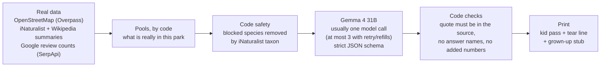

# Grass Pass: Family time is back! Powered by AI.

> Your ticket to get outside. Pick a park. Print a pass. Phone away.

**Try it live:** TODO (PM): put the production URL here at deploy (Fri Oct 9). The example passes open with no
sign-in; to make your own, press **Try as a judge** (one click, no sign-up).

TODO (PM): put one screenshot of a real pass here (the Arbor Hills example, with its date).

Grass Pass turns your local park into a one-page treasure hunt, usually in 10-30 seconds (up to about a minute and a
half for a big park or a slow model; measured, see [Limitations](#limitations)). Pick a park and your kid's age
(4-6, 6-10 or 10-13). Code collects what is really in that park. **Gemma 4** (open weights, Apache-2.0, on
DigitalOcean) picks a fair mix and writes kid-level clues, usually in one call (at most 3: a retry if the first call fails, refills if too few pass).
Code then fact-checks every clue against its source, drops any that fail, and writes every number, date and safety
line itself. You print one black-and-white page: the kid ticks boxes with a pencil; you keep a tear-off stub with the
answers, safety notes and sources. The phone stays in your pocket.

Why not a generic printable hunt? Because "Find a pinecone" fails, and parks aren't generic. Two parks in Allen, TX, measured on
Oct 5, 2026: Connemara Meadow had 70 wildlife species photographed in 14 days and no playgrounds, courts or
shelters on the map; Celebration Park had 25 soccer fields and no recent sightings. Each gets its own pass, from:
- **Park Finds:** what is mapped inside the park on OpenStreetMap (courts, playgrounds, shelters, bridges, ponds...).
- **Wild Finds:** species people photographed within 1.5 km in the last 14 days (iNaturalist, research grade only).
- **Find This Spot:** a black-and-white map of the park's paths with an X on one real landmark, drawn by code, and a
  riddle about it written by the model.
- **Lucky Finds:** "maybe" finds (a dog, a bike), only when at least 3 Google reviews of that park from the last 2
  years mention them. Code counts the reviews through SerpApi; review text is never shown or sent to the AI.
- **October special:** real monarch counts near the park, next to the same days last year (all code).

If a source has nothing, the pass says **"No data available"** and why. It never pads the pass with generic items.

Built for the DEV Hacktoberfest 2026 Open-Source AI Challenge, Week 1 "Touch Grass".

## Live demo
Live demo: (link added at deploy, Fri Oct 9)

1. On the home page, tap an **example park** (Arbor Hills Nature Preserve is the first). Today's pass is already
   made, so it opens at once, with no sign-in.
2. Press **Print pass**. One Letter page: the kid's pass on top, the grown-up's stub below.
3. To make your own: search a park by name (for example "Arbor Hills Nature Preserve") or a town, pick a park and an
   age, and press **Make my pass**. A new pass needs a grown-up to sign in (GitHub, Google optional when configured; 2 a day);
   judges press **Try as a judge** (one click, no sign-up). It usually takes 10-30 seconds, up to about a minute and a half when the free map
   servers are slow.

A town search lists the **10 nearest** named parks within 5 km, so a park you know may be missing ("Allen TX" lists 10
of its 53 nearby parks, not Connemara). Search the park's own name, or press "Use my location".

## How it works
The app's **How it works** page (`/how-it-works`) has every step, what the model is and isn't given, every reason a
clue is removed, the refill rules, caching, limits and measured numbers. The short version:



1. **You pick a park.** Nominatim (OpenStreetMap search) finds the place; the Overpass API lists nearby parks.
2. **Code collects facts:** mapped features (Overpass) and recent sightings with their Wikipedia summaries
   (iNaturalist); monarch counts from Sep 15 to Nov 15. For Lucky Finds it matches the park on Google Maps (SerpApi
   `google_maps`: same name, within 1 km of the map centre, a park and not a court inside it), then counts reviews
   from the last 24 months whose text mentions dogs, bikes, and ducks (parks with a pond) or skateboards
   (`google_maps_reviews`, newest first, up to 3 searches). A keyword needs 3 or more. Only the word, the count and
   the newest month go into the pool; counts are kept 30 days.
3. **Code decides what is safe.** The blocked groups in `src/lib/safety/danger-taxa.ts` (venomous snakes, recluse and
   widow spiders, fire ants, poison ivy...) are removed by iNaturalist taxon and ancestor ids before the model sees the
   list, and checked again after. Any species whose own description says it is poisonous, toxic, venomous, stings or
   burns the skin is left off too, and a clue with one of those words is dropped (a live pass once asked kids to find
   white snakeroot, "a poisonous perennial herb"). Every Wild Find gets a fixed "look, don't touch" line from code.
4. **An open model writes the clues** (`gemma-4-31B-it` on DigitalOcean serverless inference by default): it picks items by
   id and writes the clues. The JSON schema allows only the real pool ids.
5. **Code checks every clue.** Its `sourceQuote` must appear word for word in the item's source; it must not name its
   answer, add a number or contain a link; a "how many" question must not give its own number; a "listen" clue needs a
   source that names a sound. A failing clue is dropped, never rewritten (code only cuts a filler opener like "Quick!"
   and turns "?" after a command into a full stop). Too few left: up to two refill calls (at most 3 model calls per pass).
6. **You print it.** Black and white, one Letter page (A4 works too). Code writes every number and date, and the pass
   names the model that actually answered.

Passes are cached per park, age band and day (Chicago time), so the next visitor gets them at once. Per-IP limits and
daily caps protect the free model budget and the public map servers.

## Quick start
Needs Node 22 and pnpm.

```bash
pnpm install
cp .env.example .env.local   # add DO_INFERENCE_API_KEY (or MODEL_BASE_URL for a local Ollama)
                             # and AUTH_SECRET: npx auth secret
pnpm dev                     # http://localhost:3000
```

Every environment variable is explained in [`.env.example`](.env.example); keys are server-only. Lucky Finds need
`SERPAPI_API_KEY` (free SerpApi account), capped by `SERPAPI_DAILY_CAP` and `SERPAPI_MONTHLY_CAP`. Without
`UPSTASH_REDIS_REST_URL`/`_TOKEN`, caches and limits live in memory (fine locally). Without a model key, park search
works and a new pass says the model is not configured. `AUTH_SECRET` switches on sign-in and "Try as a judge";
without it, examples, search, shared passes and printing work, but new passes can't be made.

**Stopping spend in an emergency:** `AI_DAILY_CAP=0` pauses new model passes and `JUDGE_DEMO_DAILY_CAP=0` stops new judge
passes (`SERPAPI_DAILY_CAP=0` does the same for SerpApi); an empty `DO_INFERENCE_API_KEY` stops every model call.
At the default `AI_DAILY_CAP=400` calls (a pass makes 1-3), a full day costs about $0.28 typical and at most about $0.55
at DigitalOcean list prices; the $10 prepaid credit is the hard ceiling.

| Script | What it does |
|---|---|
| `pnpm lint` | ESLint, zero warnings allowed |
| `pnpm typecheck` | `next typegen && tsc --noEmit` |
| `pnpm test` | Vitest unit tests (recorded real API answers, no network) |
| `pnpm build` / `pnpm start` | production build / server |
| `pnpm e2e` | Playwright against `pnpm start` (port 3123, or `E2E_BASE_URL`); live tests skip honestly, with the server's error code, when an upstream or a limit says no |
| `pnpm osm:snapshot` | re-records the saved OpenStreetMap data (the 4 example parks and the Dallas-area fallback park list, `src/data/osm/`) |
| `pnpm eval` | the evals: 20 recorded real parks, live open models on DigitalOcean (about $0.07-0.09; last full run $0.090; capped at $1), plus a no-AI baseline. See [`evals/README.md`](evals/README.md) |
| `pnpm eval:check` | free dry run of every recorded park through the real pass builder, model off |
| `pnpm eval:record` | re-records the 20 eval parks live from OpenStreetMap and iNaturalist |
| `node scripts/render-brand.mjs` | re-renders every logo, icon and share image from `scripts/brand/art.mjs` and `scripts/brand/v3.mjs` |

Measured cold start (laptop: build 17.2 s, first page 0.98 s, first example pass 30.9 s), abuse limits, the storage
quota, the optional firewall rule, accounts and report moderation: [`docs/OPERATIONS.md`](docs/OPERATIONS.md).

### Run it yourself (self-hosted Gemma, measured)
The app talks to any OpenAI-compatible server. Measured on Oct 6, 2026 with the smallest Gemma 4 on a laptop with
**no GPU** (Intel Core Ultra 7 155H, 32 GB RAM, Ollama 0.32.15), 5 test parks, $0:
- **With the app's normal limits (70 s per model call, as on the hosted site), it is too slow on this CPU:** 0 of 5
  passes complete: 3 ran out of time and the other 2 came out short (6 of 8 finds).
- **Given more time (an eval-only setting), it works:** 4 of 5 passes complete, 96.7% of clues quoted their source,
  reading grade 2.9, 0 risky species printed, 59.3 s a typical model call (hosted Gemma 4 31B: 15.3 s), about 1-3
  minutes a pass, about 5-6 GB of RAM (5.2 GB working set, 5.8 GB at most). It writes about 18 answer tokens a second
  here.
- **In the app, with the longer local clock (`LOCAL_MODEL_TIMEOUT_MS=270000`), it works, slowly:** one browser
  click-through (Celebration Park, ages 6-10) made a pass with 7 of 8 finds and its Find This Spot map in **96 s**
  (2 model calls: 62.8 s and 30.7 s), while the page said "A model on this computer can take a few minutes". One run,
  not a benchmark: [`2026-10-06-selfhost-browser-1959.md`](evals/results/2026-10-06-selfhost-browser-1959.md).

Every number, the hardware and the caveats: [`evals/results/2026-10-06-selfhost-notes.md`](evals/results/2026-10-06-selfhost-notes.md).
A computer with a GPU should be much faster (not measured).

```bash
# 1. Get the model: Gemma 4 E2B, 4-bit QAT, Apache-2.0, 4.3 GB
ollama pull gemma4:e2b-it-qat
# 2. Same weights with an 8,192-token context (Ollama's default 4,096 is shorter than our longest prompt)
ollama create gemma4-e2b-8k -f evals/selfhost/Modelfile
# 3. Point the app at it: put these in .env.local (no DigitalOcean key needed)
#    MODEL_BASE_URL=http://localhost:11434/v1
#    MODEL_ID=gemma4-e2b-8k
#    MODEL_REASONING_EFFORT=none     # Gemma 4 "thinking" off; Ollama turns it on by default
#    LOCAL_MODEL_TIMEOUT_MS=270000   # longer clock for a model on THIS computer (off by default, never on Vercel):
#                                    # 4.5 min a call, 10 min a pass; the page waits and says why
#    AUTH_SECRET=...                 # npx auth secret (a new pass needs a sign-in; "Try as a judge" works)
pnpm dev
#    Then open http://localhost:3000, press "Try as a judge", pick a park and "Make my pass" (96 s in our one try)
# 4. Or measure it yourself, free, on the recorded parks (about 6 + 10 minutes on the laptop above)
EVAL_MODELS=gemma4-e2b-8k EVAL_CASES=1,2,3,13,15 pnpm eval                        # the app's limits
EVAL_MODELS=gemma4-e2b-8k EVAL_CASES=1,2,3,13,15 EVAL_LOCAL_PATIENT=1 pnpm eval   # eval-only longer clock
```

The eval runs the app's own pass builder and checks. The browser flow was clicked through once with
`LOCAL_MODEL_TIMEOUT_MS=270000` (above). The eval's "app clock" row is the normal clock, without that setting.

## Limitations
The same list as the app's `/about` page, from eval run [`2026-10-06-8.md`](evals/results/2026-10-06-8.md), made on a
slow provider evening:
- **Speed missed the goal this run: 15.3 s typical, 30.0 s slow (target 10 s / 20 s).** First calls alone took 16.4 s
  typical. DigitalOcean answered at 28.1 answer tokens a second (a probe just before the run: 45.7); at 47.3 in the run
  before (`2026-10-06-7`), the typical call took 9.4 s and met the goal. 15 Gemma calls hit their time limit (10 first
  calls, 3 of their retries, 2 refills) and 1 retry got HTTP 403; the retries saved 5 passes. Llama 4 Maverick is too
  slow to be the default: 3 of its 20 test runs ended at its 60 s limit; 52.9% complete passes.
- **Complete passes missed the goal: 82.4% (42 of 51; target 90%; 96.1% in the run before).** 4 test runs made no pass
  (the first call and its retry both failed), 2 passes were short because a refill ran out of time, and 3 were short
  on content: Connemara Meadow twice and Klyde Warren once, where all 3 model calls were made and the refills kept
  nothing. No clue-quality drop (`trivia`) touched a short pass, so we did not relax that check (a free replay of the
  run gives 42 of 51 either way). A short pass says how many finds are missing.
- **Cost missed the goal: Gemma $0.00111 a pass (target $0.001; up to $0.00127 if the 15 timed-out calls were billed in
  full; $0.00097 if they were free).** The shorter prompt worked (2,872 prompt tokens on an answered first call, 3,084
  in the run before); the miss comes from the timed-out calls, each priced at its prompt size. A finished 10-13 pass
  cost $0.00146 in the small check below.
- **Some clues are still vague: 8 of 112 printed Wild Finds** are flagged by our own checks (22 of 133 in the run
  before, counted with the same checks). A range fact or a bare colour is dropped when a spare can replace it and
  prints when none can ("Watch for a small bird that is yellow."); a field-guide word goes first ("Watch for a butterfly
  with iridescent-blue hindwings."). The checks still miss some: "What has a shell and lives in fresh water?" (a
  mussel) and "Check for a bird that is small and white." (an egret). Wikipedia jargon printed 0 times, and 0 clues
  printed a danger word or a wrong kind word ("a bug" for a spider).
- **Some clues repeat across parks: 9.7% (34 of 352; target 5%; 2.8% in the run before).** The top repeats are
  Gemma's "Somewhere you will see a" (5 parks), our bridge fact "paths that go over water" (4 parks) and the same
  species, Osage-orange, at 3 parks. A clue that listens for water is now rarer: 11 of 50 passes on 6 parks (31 of 54
  on 13 parks before), never two on one pass. Counts pass: 0 of 71 printed count clues wrong (code removed 10 first).
- **A whole new pass usually takes 10-30 seconds, and up to about a minute and a half** for a big park or a slow
  model. The model part is short (run `-8`: 23.9 s per pass, median, on recorded park data, on a slow evening), but a new pass also reads
  the live map and sightings: a judge's own pass for Prospect Park (Brooklyn, a big park) took about 57 s plus an
  11.6 s park search on Oct 6, and passes took 58-67 s when the free map servers were slow (measured Oct 6). The page
  waits up to 95 s and the server keeps a pass it started, so "Try again" opens it.
- **How a pass is made:** 1 to 3 model calls. A failed first call gets one whole retry, a refill asks for the missing
  finds + 2 spares, and a pass still short gets one more refill. **Time limits are sized from measured answer sizes**
  (about 60 answer tokens a find) **and slow-evening speeds** ([`src/lib/pass/budget.ts`](src/lib/pass/budget.ts)): the
  first call gets up to 40 s, the retry gets the time left and asks for only as many finds as can come back in it, a
  refill gets 15-30 s, and the whole pass 85 s. A short HTTP 403 refusal from the provider is asked once more after 1 s.
  Run `-8` ran with the old fixed limits (30 s a call, 20 s a refill); these limits are newer and not yet measured in a
  full run.
- **Answers that name themselves: Gemma 2.7% passes, Llama 4 Maverick 17.1% does not** (target 5%), counted before
  the checks. Code removes every such clue (and drops such a hint), so nothing is given away, but those clues are
  lost.
- **Kid check not done yet.** A grown-up reading 10 printed clues as a 7-year-old would
  ([`evals/results/human-check.md`](evals/results/human-check.md)) is planned with a real walk on **Sat Oct 10, 2026**.
  Pending, not passed.
- **Lucky Finds run on SerpApi's free plan (250 searches a month).** A new park uses up to 4 searches. Grass Pass stops
  at `SERPAPI_DAILY_CAP` (12) a day and `SERPAPI_MONTHLY_CAP` (200, never above 250) a month, counted from the plan's
  renewal day (`SERPAPI_RENEWS_DAY`), and keeps counts 30 days. Over a limit, the pass says Lucky Finds are off for
  today (or this month). A count means visitors wrote about it, not that it is there today, so the pass prints
  "Maybe!". A review counts only if its own text names the thing; a page holds 20 reviews, so a busy park can read "at
  least 20". Without `SERPAPI_API_KEY` the section says "not connected". No photos are printed.
- **Self-hosting is slow on a laptop CPU.** Measured with Gemma 4 E2B on Ollama, no GPU, 5 parks, $0: with the app's
  normal 70 s model limit, 0 of 5 passes were complete (3 ran out of time and 2 came out short); given more time (eval
  only), 4 of 5 were complete at about 1-3 minutes a pass. With the app's longer local clock (`LOCAL_MODEL_TIMEOUT_MS`,
  off by default), one browser try made a 7-of-8 pass in 96 s. See
  [Run it yourself](#run-it-yourself-self-hosted-gemma-measured).
- **Find This Spot and Lucky Finds are not in the eval.** No map geometry or SerpApi answers were recorded for the 20
  test parks, and SerpApi was off for the run (`SERPAPI_DAILY_CAP=0`, no key) to save the free searches for the live
  site.
- **Sparse data happens.** 3 of the 17 North Texas eval parks had no research-grade sightings in the last 14 days; the
  pass says so instead of inventing Wild Finds.
- **Depends on public Overpass servers,** often busy in US evenings. Park search waits 10 s, then falls back to a
  **saved list of 1,321 named Dallas-area parks** (Allen, Plano, McKinney, Frisco, Richardson, Dallas), then one
  Nominatim park search, and labels the fallback. The 4 example parks use saved map data. When nothing answers (for
  example outside Dallas while Overpass and Nominatim are both down), search says "No data available" and why, and
  offers a ready example. A new pass whose map data is late says so instead of guessing.
- **Hosted inference:** the model runs on DigitalOcean's servers, so the park facts and the age band leave your
  device (see Privacy).

## Evals
20 real parks (recorded live from OpenStreetMap and iNaturalist on Oct 5, 2026; 5 taxa and 15 season counts added on
Oct 6 after the blocklist grew), ages 6-10, run through the real pass builder. Current run:
[`2026-10-06-8.md`](evals/results/2026-10-06-8.md) (notes: [`2026-10-06-8-notes.md`](evals/results/2026-10-06-8-notes.md)),
one full run on Oct 6 after the r7 follow-ups (app commit `ef59055`), not re-run, on a slow provider evening. Open
models only: the closed models on our DigitalOcean tier answered 403 on Oct 5.

| | Gemma 4 31B (3 runs) | Llama 4 Maverick (1 run) | No-AI template | Gemma, previous run (`-7`) |
|---|---|---|---|---|
| M1 Blocked taxa printed, by taxon id (target 0) | 0 | 0 | 0 | 0 (9 when re-scored with today's 63 groups) |
| M2 Clues quoting their source word for word, before the filter (target 85%) | 99.0% | 93.8% | 100% (by construction) | 97.2% |
| M3 Passes with >= n-1 items (target 90%) | **82.4% (42/51), FAIL** (4 runs lost to the provider) | 52.9% (FAIL) | 17.6% (FAIL) | 96.1% |
| M4 Honest empty sections (target 100%) | 100% | 100% | 100% | 100% |
| M5 Reading level, FK grade median (target <= 3.5) | 2.5 | 2.5 | 2.8 | 2.5 |
| M6 Name leaks in clue or hint, before the filter (target <= 5%) | 2.7% (clue only 2.7%) | 17.1% (FAIL) | 1.4% | 2.8% |
| M7 Model call p50 / p95 (target 10 s / 20 s) | **15.3 s / 30.0 s, FAIL** (first calls alone 16.4 s; 28.1 answer tokens/s) | 25.8 s / 60.0 s (FAIL, 3 passes timed out) | none | 9.4 s / 13.8 s |
| M8 Cost per pass (target $0.001) | **$0.00111 to $0.00127, FAIL** (15 timed-out calls: prompt only, or billed in full; $0.00097 at $0) | $0.00166 to $0.00236 (FAIL) | $0 | $0.00103 to $0.00105 |
| M10 Printed clues repeated across parks (target <= 5%) | **9.7% (34/352), FAIL** | 0% (0/88) | 20.4% (FAIL) | 2.8% |
| M11 Printed clues with a wrong count (target 0) | 0 of 71 (10 removed by the check) | 0 of 7 (9 removed) | 0 of 3 | 0 of 86 (4 removed) |

Gemma calls: 94 for 60 test runs (50 passes: 25 used 1 call, 14 used 2, 11 used 3; 6 runs on the 2 no-data parks made
none; 4 runs were lost when the first call and its retry both failed). Printed Wild Finds that our own checks call
jargon or trivia: 8 of 112 (7.1%; run `-7` with the same checks: 22 of 133). Passes with a clue that listens for water:
11 of 50 on 6 parks (run `-7`: 31 of 54 on 13 parks). The no-AI template stays at 17.6% complete passes: its clue is a
species' first Wikipedia sentence with the name masked ("____ is a species of flowering plant in the aster family"),
which is what the `jargon` check drops.

Ages 10-13, a partial check ([`2026-10-06-partial-2121.md`](evals/results/2026-10-06-partial-2121.md), the same 3
parks as the checks before it, not re-run): **3 of 3 complete** in 6 model calls, **2 of 3 kept their 2 hard finds**
(Cedar Ridge printed 1), grade 3.8 (aim 5-6), 11.1 s / 14.1 s per call (the typical time is **over** the 10 s target),
5.3% name leaks before the checks (**over** the 5% target; code removed them all), and $0.00146 per pass, **over** the
$0.001 mark. Only 6 model calls, so a small sample.

What got worse since the previous run and why, earlier runs, and every tuning change:
[`docs/EVALS.md`](docs/EVALS.md). The app's `/about` page shows the same numbers (`src/lib/about/eval-summary.ts`,
checked against the results JSON by a unit test).

### Why open
- **Kid-sized words:** Gemma's clues read at FK grade 2.5 (median), and only 8 of its 112 printed Wild Finds were
  flagged by our checks; the no-AI template on the same data (Wikipedia's own first sentences) completes 17.6% of
  passes.
- **Sticks to the facts:** 99.0% of its clues quoted their source word for word before any filter (code drops the
  rest); 0 blocked species printed in 60 runs.
- **Cheap enough for a classroom:** about $0.00111 to $0.00127 per pass at DigitalOcean list prices on a slow evening
  with 15 timed-out calls ($0.00097 if those were free; our goal is $0.001).
- **Safety rules live in our code, not a vendor's:** the same checks run on any model, switching is one setting
  (`MODEL_ID`), and Llama 4 Maverick ran through the same code in the eval.
- **You can run it yourself:** the weights are downloadable (Apache-2.0) and the app talks to any OpenAI-compatible
  server, such as Ollama. **Measured** on a laptop with no GPU (Gemma 4 E2B, 5 parks, $0): the checks hold (0 risky
  species printed, 96.7% of clues grounded), but it is too slow for the app's normal 70 s limit (0 of 5 complete). With
  the longer local clock (`LOCAL_MODEL_TIMEOUT_MS`), one browser try made a 7-of-8 pass in 96 s; the eval gave 1-3
  minutes a pass ([details](#run-it-yourself-self-hosted-gemma-measured)).

## Accounts and reports
Anyone can search, open the example passes and any shared link, and print. **A NEW pass needs a grown-up to sign in**
with GitHub, or Google when configured (Auth.js / next-auth v5; no password stored): **2 new passes a day per account** (Chicago
day). A pass already made today for that park and age is served to anyone. **Try as a judge** signs in to a shared
demo account in one click (`JUDGE_DEMO_DAILY_CAP`, default 60 a day for all judges, at most 3 per connection).
Signed-in visitors can report each find (Found it / Didn't find it / Not safe); thresholds count different accounts,
and judge demo reports are only logged. Limits, sessions, moderation and provider setup:
[`docs/OPERATIONS.md`](docs/OPERATIONS.md#accounts-and-visitor-reports).

## Privacy
No names, no photos, no analytics, and nothing about the child is asked for or sent. Browsing, examples, shared links
and printing set no cookie; a grown-up who signs in gets one encrypted, httpOnly, SameSite=Lax cookie (Secure on
https). What leaves the device (also on `/about`):

| What | Where it goes | Why |
|---|---|---|
| Typed place text | our server (in the request body, never the web address), then Nominatim; cached 30 days in Upstash Redis by the text, not by who typed it | find the town or park |
| "Use my location" | rounded in the browser to 2 decimals (~1 km), then our server, then Overpass | list nearby parks |
| The chosen park (public place + map position) | our server, then Overpass, iNaturalist and SerpApi (name and position only) | park map, sightings, monarch counts, review counts |
| Age band | our server, then the model on DigitalOcean (in the prompt) | item count and reading level |
| IP address | our server; in Upstash Redis only as a keyed hash (HMAC), never the address, in rate-limit counters that expire within about a day (IPv6 by its /64 and /48 network) | abuse and cost limits |
| Every request (IP, web address, time) | Vercel request logs, about 1 hour on the Hobby plan; searches are POSTs, so the logs never hold the typed place or location | running the site |
| Signing in (grown-ups only) | GitHub (or Google, when configured) sends the public profile (account number, name, picture link; for GitHub any public email). We store only an HMAC of provider + account number (keyed with `AUTH_SECRET`); the rest is dropped at once: no email, name or avatar is stored. A first name goes only into the person's own encrypted cookie. Scopes: GitHub `read:user`, Google `openid profile`. 7 days from sign-in; the judge demo sign-in stops working after 1 day | count 2 new passes a day and the reports |
| Item reports | per park and item, each visitor's latest kind and day under a per-park reporter ID (an HMAC, so IDs can't be linked across parks); judge demo reports only logged; deleted after 90 days | learn what is findable, leave out unfindable or unsafe finds |
| The finished pass | Upstash Redis, 30 days | the pass link and print page |

Our server logs record source/model, timing, outcome and pass ids; never the prompt, the IP address or the typed
text. Review text is never shown, stored or sent to the AI (only the keyword, count and newest month), and the SerpApi
key never leaves the server or appears in a log. The IP hash key is `LIMITER_KEY_SECRET` (if unset, derived from the
Upstash token; random per process without Upstash). The browser keeps only the light/dark choice and the last age
band (localStorage), plus the park and age picked before signing in (sessionStorage, removed once restored).

## Contributing
Contributions are welcome. See [CONTRIBUTING.md](CONTRIBUTING.md) for setup, checks and the house rules (no made-up
data, every number written by code), and [docs/good-first-issues.md](docs/good-first-issues.md) for three starter
ideas. How the app was built, slice by slice: [docs/BUILD-LOG.md](docs/BUILD-LOG.md).

## Contest note
Built during the Hacktoberfest 2026 Week 1 entry period (first commit Oct 5, 2026, 5:11 PM CDT). Any commit made
after the submission deadline (Mon Oct 12, 2026, 06:59 UTC) will be listed here.

## Credits
- Scaffolded with [`create-next-app`](https://nextjs.org/docs/app/api-reference/cli/create-next-app) (Next.js, MIT).
- **Reused code written before the entry period.** A few generic building blocks were adapted from the same author's
  unpublished practice project, written on **Oct 2, 2026, before the contest entry period** (same author, MIT): the
  model client (`src/lib/model.ts`), rate limits, caps and breakers (`src/lib/limits/rate.ts`, `quota.ts`,
  `breaker.ts`, `ip.ts`), request guards (`src/lib/http/guard.ts`), in-flight de-duplication
  (`src/lib/cache/inflight.ts`) and small helpers (`src/lib/security-headers.ts`, `src/lib/zod-config.ts`). They have
  changed a lot since. Everything specific to Grass Pass was written from **Oct 5, 2026**: data sources, pools,
  safety filter, prompt, clue checks, the pass, print layout, Find This Spot map, October box, evals and brand.
- **Site design (v3, Oct 6, 2026):** designed by Kevin in [v0 by Vercel](https://v0.app/) and ported by hand (no v0
  runtime code, no analytics). Logo and icons: [Lucide](https://lucide.dev/) (`lucide-react`, ISC).
- **Site copy (Oct 6, 2026):** Gemma 4 (the app's own model, on DigitalOcean) redrafted 184 blocks of the site's
  text; 90 of its drafts shipped (13 with small edits) after a code check and a review by an AI coding agent
  (Claude Code), and the rest kept their old text. No person has reviewed the drafts yet. Every block, old and new,
  with the reason: [docs/COPY-BY-GEMMA.md](docs/COPY-BY-GEMMA.md)
  (re-run with `pnpm copy:gemma`, ~$0.01). Kevin's own lines (home hero, problem band, how-it-works headline) are his.
- **Home page pictures:** the hero is an AI illustration generated with v0 by Vercel (labelled "AI illustration"; it
  shows no real child or park). The four park photos are real, used under their free licences (credited on each
  photo, under the cards and on `/about`; details in `src/data/photo-credits.ts`), resized and converted to WebP:
  - Arbor Hills Nature Preserve: [trail vista](https://commons.wikimedia.org/wiki/File:Arbor_Hills_Nature_Preserve.jpg)
    by Robert Nunnally, [CC BY 2.0](https://creativecommons.org/licenses/by/2.0/) (Wikimedia Commons).
  - White Rock Lake: [Dallas Texas - HCP - September 21, 2022 - 007 - White Rock Lake](https://commons.wikimedia.org/wiki/File:Dallas_Texas_-_HCP_-_September_21,_2022_-_007_-_White_Rock_Lake.jpg)
    by Vulturesong, [CC0 1.0](https://creativecommons.org/publicdomain/zero/1.0/) (Wikimedia Commons).
  - Celebration Park: [Sunday morning walk](https://www.flickr.com/photos/46183897@N00/6369488567/) by Robert Nunnally,
    [CC BY 2.0](https://creativecommons.org/licenses/by/2.0/) (Flickr).
  - Connemara Meadow Preserve: [Connemara Meadow](https://www.flickr.com/photos/46183897@N00/17345556215/) by Robert
    Nunnally, [CC BY 2.0](https://creativecommons.org/licenses/by/2.0/) (Flickr).
- **Brand (printed pass):** the original banner was made by Kevin with Google Gemini; the logo and scene are a traced,
  hand-cleaned SVG redraw of it (`brand/`, `scripts/brand/art.mjs`; the kid's clothes and hair are cleaned traces in
  `scripts/brand/kid-trace.json`).
- **Favicon, app icons, share image and DEV cover (v3):** the v3 logo (green ticket with the Lucide "sprout", ISC) in
  the v3 colours, drawn as SVG by `scripts/brand/v3.mjs` and rasterised by `scripts/render-brand.mjs`. Text is outlined
  from [Bricolage Grotesque](https://fonts.google.com/specimen/Bricolage+Grotesque) 800 and
  [DM Sans](https://fonts.google.com/specimen/DM+Sans) 500/700 (`@fontsource`, dev only, SIL OFL 1.1). The share
  image's pass shows only real section names, no clue text.
- **Fonts:** Bricolage Grotesque and DM Sans for the site (latin variable `.woff2`, `@fontsource-variable` 5.3.0);
  [Fredoka](https://fonts.google.com/specimen/Fredoka) 600/700 and [Nunito](https://fonts.google.com/specimen/Nunito)
  400/600/700 for the printed pass ([Fontsource](https://fontsource.org/) 5.3.0). All are committed in
  `src/app/fonts/` with their OFL texts and served by `next/font/local`, so nothing contacts Google Fonts. The logo
  lettering is outlined from [M PLUS Rounded 1c](https://fonts.google.com/specimen/M+PLUS+Rounded+1c) ExtraBold and
  [Varela Round](https://fonts.google.com/specimen/Varela+Round) (`@fontsource`, dev only). All six are SIL Open Font
  License 1.1.
- Asset tooling (dev only): [opentype.js](https://github.com/opentypejs/opentype.js) (MIT) and
  [@resvg/resvg-js](https://github.com/thx/resvg-js) (MPL-2.0). Accessibility checks in e2e (dev only):
  [@axe-core/playwright](https://github.com/dequelabs/axe-core-npm) (MPL-2.0).
- Park names, locations and features: © [OpenStreetMap contributors](https://www.openstreetmap.org/copyright), ODbL 1.0,
  via [Nominatim](https://nominatim.org/) and the public Overpass instances at overpass-api.de, maps.mail.ru (VK Maps)
  and overpass.private.coffee (under their usage policies). The saved park data in `src/data/osm/` is OpenStreetMap
  data too (ODbL).
- Wildlife sightings and monarch counts: [iNaturalist](https://www.inaturalist.org/) observers (research-grade; names
  and counts only, no photos).
- Species facts: Wikipedia (CC BY-SA), via the iNaturalist API. Wild Find clues quote these summaries; the printed stub
  says "Species facts: Wikipedia (CC BY-SA), via iNaturalist." whenever a pass has a Wild Find.
- Clues: [Gemma 4](https://huggingface.co/google/gemma-4-31B-it) (`gemma-4-31B-it`, Apache-2.0) on DigitalOcean
  serverless inference.
- Eval comparison: Llama 4 Maverick (Llama 4 Community Licence), on DigitalOcean serverless inference. It answers
  visitors only if `MODEL_ID` is switched to it; then the pass and `/about` show "Built with Llama".
- Lucky Finds: Google Maps review counts via [SerpApi](https://serpapi.com/) (`google_maps` and `google_maps_reviews`;
  counts and months only, never review text or reviewer names).

## Licence
The code is [MIT](LICENSE). MIT covers the code only; recorded data keeps its source licence:
- `src/data/osm/` and the OpenStreetMap answers in `tests/fixtures/` and `tests/fixtures/evals/`: © OpenStreetMap
  contributors, [ODbL 1.0](https://opendatacommons.org/licenses/odbl/1-0/) (share-alike applies to derived databases).
- iNaturalist observations and taxa in those fixtures: each keeps the licence its observer chose (shown on iNaturalist).
- Wikipedia summaries (via iNaturalist) in those fixtures: [CC BY-SA](https://creativecommons.org/licenses/by-sa/4.0/).
- Fonts keep their OFL licences (see Credits).
