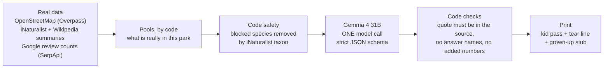

# Grass Pass: an open model reads your park and writes a one-page pass

> Your ticket to get outside. Pick a park. Print a pass. Phone away.

**Try it live:** TODO (PM): put the production URL here at deploy (Fri Oct 9). The example passes open with no
sign-in; to make your own, press **Try as a judge** (one click, no sign-up).

TODO (PM): put one screenshot of a real pass here (the Arbor Hills example, with its date).

Grass Pass turns one real park into a one-page pass a child can carry outside. A grown-up picks a park and an age
(4-6, 6-10 or 10-13). Code collects what is really in that park. **Gemma 4** (open weights, Apache-2.0, on
DigitalOcean) picks a fair mix and writes kid-level clues in one call (plus one refill call if too few pass). Code
then checks every clue against its source, drops any that fail, and writes every number, date and safety line itself.
You print one black-and-white page: the kid ticks boxes with a pencil; the grown-up keeps a tear-off stub with the
answers, safety notes and sources.

Why not a generic printable hunt? "Find a pinecone" fits every park and none. Two parks in Allen, TX, measured on
Oct 5, 2026: Connemara Meadow had 70 wildlife species photographed in 14 days and no playgrounds, courts or
shelters on the map; Celebration Park had 25 soccer fields and no recent sightings. Each gets its own pass, from:
- **Park Finds:** what is mapped inside the park on OpenStreetMap (courts, playgrounds, shelters, bridges, ponds...).
- **Wild Finds:** species people photographed within 1.5 km in the last 14 days (iNaturalist, research grade only).
- **Find This Spot:** a black-and-white map of the park's paths with an X on one real landmark, drawn by code, and a
  riddle about it written by the model.
- **Lucky Finds:** "maybe" finds (a dog, a bike), only when at least 3 Google reviews of that park from the last 2
  years mention them. Code counts the reviews through SerpApi; review text is never shown or sent to the AI.
- **October special:** real monarch counts near the park, next to the same days last year (all code).

If a source has nothing, the pass says **"No data available"** and why. It never pads the pass with generic items.

Built for the DEV Hacktoberfest 2026 Open-Source AI Challenge, Week 1 "Touch Grass".

## Live demo
Live demo: (link added at deploy, Fri Oct 9)

1. On the home page, tap an **example park** (Arbor Hills Nature Preserve is the first). Today's pass is already
   made, so it opens at once, with no sign-in.
2. Press **Print pass**. One Letter page: the kid's pass on top, the grown-up's stub below.
3. To make your own: search a park by name (for example "Arbor Hills Nature Preserve") or a town, pick a park and an
   age, and press **Make my pass**. A new pass needs a grown-up to sign in (GitHub, Google optional when configured; 2 a day);
   judges press **Try as a judge** (one click, no sign-up). It usually takes 10-30 seconds, up to about a minute and a half when the free map
   servers are slow.

A town search lists the **10 nearest** named parks within 5 km, so a park you know may be missing ("Allen TX" lists 10
of its 53 nearby parks, not Connemara). Search the park's own name, or press "Use my location".

## How it works
The app's **How it works** page (`/how-it-works`) has every step, what the model is and isn't given, every reason a
clue is removed, the refill rules, caching, limits and measured numbers. The short version:



1. **You pick a park.** Nominatim (OpenStreetMap search) finds the place; the Overpass API lists nearby parks.
2. **Code collects facts:** mapped features (Overpass) and recent sightings with their Wikipedia summaries
   (iNaturalist); monarch counts from Sep 15 to Nov 15. For Lucky Finds it matches the park on Google Maps (SerpApi
   `google_maps`: same name, within 1 km of the map centre, a park and not a court inside it), then counts reviews
   from the last 24 months whose text mentions dogs, bikes, and ducks (parks with a pond) or skateboards
   (`google_maps_reviews`, newest first, up to 3 searches). A keyword needs 3 or more. Only the word, the count and
   the newest month go into the pool; counts are kept 30 days.
3. **Code decides what is safe.** The blocked groups in `src/lib/safety/danger-taxa.ts` (venomous snakes, recluse and
   widow spiders, fire ants, poison ivy...) are removed by iNaturalist taxon and ancestor ids before the model sees the
   list, and checked again after. Every Wild Find gets a fixed "look, don't touch" line from code.
4. **One call to an open model** (`gemma-4-31B-it` on DigitalOcean serverless inference by default) picks items by
   id and writes the clues. The JSON schema allows only the real pool ids.
5. **Code checks every clue.** Its `sourceQuote` must appear word for word in the item's source; it must not name its
   answer, add a number or contain a link; a "how many" question must not give its own number; a "listen" clue needs a
   source that names a sound. A failing clue is dropped, never rewritten (code only cuts a filler opener like "Quick!"
   and turns "?" after a command into a full stop). Too few left: one refill call.
6. **You print it.** Black and white, one Letter page (A4 works too). Code writes every number and date, and the pass
   names the model that actually answered.

Passes are cached per park, age band and day (Chicago time), so the next visitor gets them at once. Per-IP limits and
daily caps protect the free model budget and the public map servers.

## Quick start
Needs Node 22 and pnpm.

```bash
pnpm install
cp .env.example .env.local   # add DO_INFERENCE_API_KEY (or MODEL_BASE_URL for a local Ollama)
                             # and AUTH_SECRET: npx auth secret
pnpm dev                     # http://localhost:3000
```

Every environment variable is explained in [`.env.example`](.env.example); keys are server-only. Lucky Finds need
`SERPAPI_API_KEY` (free SerpApi account), capped by `SERPAPI_DAILY_CAP` and `SERPAPI_MONTHLY_CAP`. Without
`UPSTASH_REDIS_REST_URL`/`_TOKEN`, caches and limits live in memory (fine locally). Without a model key, park search
works and a new pass says the model is not configured. `AUTH_SECRET` switches on sign-in and "Try as a judge";
without it, examples, search, shared passes and printing work, but new passes can't be made.

| Script | What it does |
|---|---|
| `pnpm lint` | ESLint, zero warnings allowed |
| `pnpm typecheck` | `next typegen && tsc --noEmit` |
| `pnpm test` | Vitest unit tests (recorded real API answers, no network) |
| `pnpm build` / `pnpm start` | production build / server |
| `pnpm e2e` | Playwright against `pnpm start` (port 3123, or `E2E_BASE_URL`); live tests skip honestly, with the server's error code, when an upstream or a limit says no |
| `pnpm osm:snapshot` | re-records the saved OpenStreetMap data (the 4 example parks and the Dallas-area fallback park list, `src/data/osm/`) |
| `pnpm eval` | the evals: 20 recorded real parks, live open models on DigitalOcean (about $0.05-0.08; last full run $0.058; capped at $1), plus a no-AI baseline. See [`evals/README.md`](evals/README.md) |
| `pnpm eval:check` | free dry run of every recorded park through the real pass builder, model off |
| `pnpm eval:record` | re-records the 20 eval parks live from OpenStreetMap and iNaturalist |
| `node scripts/render-brand.mjs` | re-renders every logo, icon and share image from `scripts/brand/art.mjs` and `scripts/brand/v3.mjs` |

Measured cold start (laptop: build 17.2 s, first page 0.98 s, first example pass 30.9 s), abuse limits, the storage
quota, the optional firewall rule, accounts and report moderation: [`docs/OPERATIONS.md`](docs/OPERATIONS.md).

## Limitations
The same list as the app's `/about` page, from eval run [`2026-10-06-5.md`](evals/results/2026-10-06-5.md):
- **Clues repeat across parks: Gemma 9.6%** of printed clues share 5 words in a row with clues on at least 2 other
  parks (target 5%), down from 13.4% in the run before (`2026-10-06-4`): still a miss. The park-fact phrases that
  repeated before are gone; 21 of the 36 repeats now share their first 5 words, Gemma's own clue openings
  ("Somewhere you will see a" on 6 parks, "Where can you hear water" on 4) and a "Count the 2 of them." ending. Counts
  pass: 0 of 81 printed count clues wrong (code removed 13 first).
- **Speed misses: 12.3 s typical, 23.8 s slow (target 10 s / 20 s).** First calls alone took 13.7 s typical. The
  provider was slower in this run: the median Gemma call ran at 34.3 answer tokens a second against 46.2 in the run
  before (answers were not longer), so part of the miss is DigitalOcean's speed that day, but it is a miss. Llama 4
  Maverick is too slow to be the default: 11 of its 20 test passes hit its 60 s limit, 29.4% complete passes.
- **Complete passes: Gemma 84.3% misses (43 of 51; target 90%),** down from 98% in the run before. 7 passes ended 2
  or 3 finds short after their second try (the stricter audit-round-4 checks removed more clues: name leaks 15 -> 23,
  wrong counts 4 -> 12; 1 second try timed out at 30 s), and 1 first call failed with HTTP 403. A short pass says
  how many finds are missing.
- **Answers that name themselves: Gemma 4.5% passes (close to the mark), Llama 4 Maverick 6.2% does not** (target 5%),
  counted before the checks. Code removes every such clue (and drops such a hint), so nothing is given away, but
  those clues are lost.
- **Kid check not done yet.** A grown-up reading 10 printed clues as a 7-year-old would
  ([`evals/results/human-check.md`](evals/results/human-check.md)) is planned with a real walk on **Sat Oct 10, 2026**.
  Pending, not passed.
- **Lucky Finds run on SerpApi's free plan (250 searches a month).** A new park uses up to 4 searches. Grass Pass stops
  at `SERPAPI_DAILY_CAP` (12) a day and `SERPAPI_MONTHLY_CAP` (200, never above 250) a month, counted from the plan's
  renewal day (`SERPAPI_RENEWS_DAY`), and keeps counts 30 days. Over a limit, the pass says Lucky Finds are off for
  today (or this month). A count means visitors wrote about it, not that it is there today, so the pass prints
  "Maybe!". A review counts only if its own text names the thing; a page holds 20 reviews, so a busy park can read "at
  least 20". Without `SERPAPI_API_KEY` the section says "not connected". No photos are printed.
- **Self-hosting is not measured.** The app talks to any OpenAI-compatible server (for example Ollama), but no
  self-hosted run has been measured.
- **Find This Spot and Lucky Finds are not in the eval.** No map geometry or SerpApi answers were recorded for the 20
  test parks, and SerpApi was off for the run (`SERPAPI_DAILY_CAP=0`, no key) to save the free searches for the live
  site.
- **Sparse data happens.** 3 of the 17 North Texas eval parks had no research-grade sightings in the last 14 days; the
  pass says so instead of inventing Wild Finds.
- **Depends on public Overpass servers,** often busy in US evenings. Park search waits 10 s, then falls back to a
  **saved list of 1,321 named Dallas-area parks** (Allen, Plano, McKinney, Frisco, Richardson, Dallas), then one
  Nominatim park search, and labels the fallback. The 4 example parks use saved map data. When nothing answers (for
  example outside Dallas while Overpass and Nominatim are both down), search says "No data available" and why, and
  offers a ready example. A new pass whose map data is late says so instead of guessing.
- **Hosted inference:** the model runs on DigitalOcean's servers, so the park facts and the age band leave your
  device (see Privacy).

## Evals
20 real parks (recorded live from OpenStreetMap and iNaturalist on Oct 5, 2026), ages 6-10, run through the real pass
builder. Current run: [`2026-10-06-5.md`](evals/results/2026-10-06-5.md) (notes:
[`2026-10-06-5-notes.md`](evals/results/2026-10-06-5-notes.md)), one full run on Oct 6 after audit round 4 (app commit
`74c8712`), not re-run. Open models only: the closed models on our DigitalOcean tier answered 403 on Oct 5.

| | Gemma 4 31B (3 runs) | Llama 4 Maverick (1 run) | No-AI template | Gemma, previous run (`-4`) |
|---|---|---|---|---|
| M1 Blocked taxa printed (target 0) | 0 | 0 | 0 | 0 |
| M2 Clues quoting their source word for word, before the filter (target 85%) | 98.6% | 98.5% | 100% (by construction) | 99.4% |
| M3 Passes with >= n-1 items (target 90%) | **84.3% (43/51), FAIL** | 29.4% (FAIL) | 17.6% (FAIL) | 98.0% |
| M4 Honest empty sections (target 100%) | 100% | 100% | 100% | 100% |
| M5 Reading level, FK grade median (target <= 3.5) | 2.3 | 2.3 | 3.6 (FAIL) | 2.5 |
| M6 Name leaks in clue or hint, before the filter (target <= 5%) | 4.5% (clue only 4.3%) | 6.2% (FAIL) | 1.4% | 3.7% |
| M7 Model call p50 / p95 (target 10 s / 20 s) | **12.3 s / 23.8 s, FAIL** (first calls alone 13.7 s) | 60.0 s / 60.0 s (FAIL, 11 timeouts) | none | 10.0 s / 16.1 s |
| M8 Cost per pass (target $0.001) | $0.00089 | $0.00054 (low only because timed-out calls bill nothing) | $0 | $0.00089 |
| M10 Printed clues repeated across parks (target <= 5%) | **9.6% (36/374), FAIL** | 0% (0/51) | 18.2% (FAIL) | 13.4% (FAIL) |
| M11 Printed clues with a wrong count (target 0) | 0 of 81 (13 removed by the check) | 0 of 5 (1 removed) | 0 of 6 | 0 of 136 (7 removed) |

The no-AI template's M3 fell from 88.2% to 17.6% because a repeated opening is now a hard drop, and its masked
Wikipedia sentences ("____ is a species of ...") all open the same way (replayed offline: 28 of its drops).

Ages 10-13, a partial check ([`2026-10-06-partial-1439.md`](evals/results/2026-10-06-partial-1439.md), 3 parks,
not re-run): **only 1 of 3 complete** (Arbor Hills 7/8; White Rock 6/8 after a refill; Cedar Ridge's call hit the 30 s
limit), grade 3.1 (aim 5-6), 13.4 s / 27.6 s per call, 5.0% name leaks before the checks (removed), and about
$0.00123 per finished pass, over the $0.001 mark (the scorer's $0.00082 divides by all 3 cases, including the one
that timed out).

What got worse since the previous run and why, earlier runs, and every tuning change:
[`docs/EVALS.md`](docs/EVALS.md). The app's `/about` page shows the same numbers (`src/lib/about/eval-summary.ts`,
checked against the results JSON by a unit test).

### Why open
- **Kid-sized words:** Gemma's clues read at FK grade 2.3 (median); the no-AI template on the same data reads at 3.6.
- **Sticks to the facts:** 98.6% of its clues quoted their source word for word before any filter (code drops the
  rest); 0 blocked species printed in 60 runs.
- **Cheap enough for a classroom:** about $0.00089 per pass at DigitalOcean list prices.
- **Safety rules live in our code, not a vendor's:** the same checks run on any model, switching is one setting
  (`MODEL_ID`), and Llama 4 Maverick ran through the same code in the eval.
- **You can run it yourself:** the weights are downloadable (Apache-2.0) and the app talks to any OpenAI-compatible
  server, such as Ollama. A self-hosted run has **not** been measured yet.

## Accounts and reports
Anyone can search, open the example passes and any shared link, and print. **A NEW pass needs a grown-up to sign in**
with GitHub, or Google when configured (Auth.js / next-auth v5; no password stored): **2 new passes a day per account** (Chicago
day). A pass already made today for that park and age is served to anyone. **Try as a judge** signs in to a shared
demo account in one click (`JUDGE_DEMO_DAILY_CAP`, default 60 a day for all judges, at most 3 per connection).
Signed-in visitors can report each find (Found it / Didn't find it / Not safe); thresholds count different accounts,
and judge demo reports are only logged. Limits, sessions, moderation and provider setup:
[`docs/OPERATIONS.md`](docs/OPERATIONS.md#accounts-and-visitor-reports).

## Privacy
No names, no photos, no analytics, and nothing about the child is asked for or sent. Browsing, examples, shared links
and printing set no cookie; a grown-up who signs in gets one encrypted, httpOnly, SameSite=Lax cookie (Secure on
https). What leaves the device (also on `/about`):

| What | Where it goes | Why |
|---|---|---|
| Typed place text | our server (in the request body, never the web address), then Nominatim; cached 30 days in Upstash Redis by the text, not by who typed it | find the town or park |
| "Use my location" | rounded in the browser to 2 decimals (~1 km), then our server, then Overpass | list nearby parks |
| The chosen park (public place + map position) | our server, then Overpass, iNaturalist and SerpApi (name and position only) | park map, sightings, monarch counts, review counts |
| Age band | our server, then the model on DigitalOcean (in the prompt) | item count and reading level |
| IP address | our server; in Upstash Redis only as a keyed hash (HMAC), never the address, in rate-limit counters that expire within about a day (IPv6 by its /64 and /48 network) | abuse and cost limits |
| Every request (IP, web address, time) | Vercel request logs, about 1 hour on the Hobby plan; searches are POSTs, so the logs never hold the typed place or location | running the site |
| Signing in (grown-ups only) | GitHub (or Google, when configured) sends an account number and a name. We store only an HMAC of provider + account number (keyed with `AUTH_SECRET`): no email, name or avatar. A first name goes only into the person's own encrypted cookie. Scopes: GitHub `read:user`, Google `openid profile`. 7 days from sign-in; the judge demo sign-in stops working after 1 day | count 2 new passes a day and the reports |
| Item reports | per park and item, each visitor's latest kind and day under a per-park reporter ID (an HMAC, so IDs can't be linked across parks); judge demo reports only logged; deleted after 90 days | learn what is findable, leave out unfindable or unsafe finds |
| The finished pass | Upstash Redis, 30 days | the pass link and print page |

Our server logs record source/model, timing, outcome and pass ids; never the prompt, the IP address or the typed
text. Review text is never shown, stored or sent to the AI (only the keyword, count and newest month), and the SerpApi
key never leaves the server or appears in a log. The IP hash key is `LIMITER_KEY_SECRET` (if unset, derived from the
Upstash token; random per process without Upstash). The browser keeps only the light/dark choice and the last age
band (localStorage), plus the park and age picked before signing in (sessionStorage, removed once restored).

## Contributing
Contributions are welcome. See [CONTRIBUTING.md](CONTRIBUTING.md) for setup, checks and the house rules (no made-up
data, every number written by code), and [docs/good-first-issues.md](docs/good-first-issues.md) for three starter
ideas. How the app was built, slice by slice: [docs/BUILD-LOG.md](docs/BUILD-LOG.md).

## Contest note
Built during the Hacktoberfest 2026 Week 1 entry period (first commit Oct 5, 2026, 5:11 PM CDT). Any commit made
after the submission deadline (Mon Oct 12, 2026, 06:59 UTC) will be listed here.

## Credits
- Scaffolded with [`create-next-app`](https://nextjs.org/docs/app/api-reference/cli/create-next-app) (Next.js, MIT).
- **Reused code written before the entry period.** A few generic building blocks were adapted from the same author's
  unpublished practice project, written on **Oct 2, 2026, before the contest entry period** (same author, MIT): the
  model client (`src/lib/model.ts`), rate limits, caps and breakers (`src/lib/limits/rate.ts`, `quota.ts`,
  `breaker.ts`, `ip.ts`), request guards (`src/lib/http/guard.ts`), in-flight de-duplication
  (`src/lib/cache/inflight.ts`) and small helpers (`src/lib/security-headers.ts`, `src/lib/zod-config.ts`). They have
  changed a lot since. Everything specific to Grass Pass was written from **Oct 5, 2026**: data sources, pools,
  safety filter, prompt, clue checks, the pass, print layout, Find This Spot map, October box, evals and brand.
- **Site design (v3, Oct 6, 2026):** designed by Kevin in [v0 by Vercel](https://v0.app/) and ported by hand (no v0
  runtime code, no analytics). Logo and icons: [Lucide](https://lucide.dev/) (`lucide-react`, ISC).
- **Home page pictures:** the hero is an AI illustration generated with v0 by Vercel (labelled "AI illustration"; it
  shows no real child or park). The four park photos are real, used under their free licences (credited on each
  photo, under the cards and on `/about`; details in `src/data/photo-credits.ts`), resized and converted to WebP:
  - Arbor Hills Nature Preserve: [trail vista](https://commons.wikimedia.org/wiki/File:Arbor_Hills_Nature_Preserve.jpg)
    by Robert Nunnally, [CC BY 2.0](https://creativecommons.org/licenses/by/2.0/) (Wikimedia Commons).
  - White Rock Lake: [Dallas Texas - HCP - September 21, 2022 - 007 - White Rock Lake](https://commons.wikimedia.org/wiki/File:Dallas_Texas_-_HCP_-_September_21,_2022_-_007_-_White_Rock_Lake.jpg)
    by Vulturesong, [CC0 1.0](https://creativecommons.org/publicdomain/zero/1.0/) (Wikimedia Commons).
  - Celebration Park: [Sunday morning walk](https://www.flickr.com/photos/46183897@N00/6369488567/) by Robert Nunnally,
    [CC BY 2.0](https://creativecommons.org/licenses/by/2.0/) (Flickr).
  - Connemara Meadow Preserve: [Connemara Meadow](https://www.flickr.com/photos/46183897@N00/17345556215/) by Robert
    Nunnally, [CC BY 2.0](https://creativecommons.org/licenses/by/2.0/) (Flickr).
- **Brand (printed pass):** the original banner was made by Kevin with Google Gemini; the logo and scene are a traced,
  hand-cleaned SVG redraw of it (`brand/`, `scripts/brand/art.mjs`; the kid's clothes and hair are cleaned traces in
  `scripts/brand/kid-trace.json`).
- **Favicon, app icons, share image and DEV cover (v3):** the v3 logo (green ticket with the Lucide "sprout", ISC) in
  the v3 colours, drawn as SVG by `scripts/brand/v3.mjs` and rasterised by `scripts/render-brand.mjs`. Text is outlined
  from [Bricolage Grotesque](https://fonts.google.com/specimen/Bricolage+Grotesque) 800 and
  [DM Sans](https://fonts.google.com/specimen/DM+Sans) 500/700 (`@fontsource`, dev only, SIL OFL 1.1). The share
  image's pass shows only real section names, no clue text.
- **Fonts:** Bricolage Grotesque and DM Sans for the site (latin variable `.woff2`, `@fontsource-variable` 5.3.0);
  [Fredoka](https://fonts.google.com/specimen/Fredoka) 600/700 and [Nunito](https://fonts.google.com/specimen/Nunito)
  400/600/700 for the printed pass ([Fontsource](https://fontsource.org/) 5.3.0). All are committed in
  `src/app/fonts/` with their OFL texts and served by `next/font/local`, so nothing contacts Google Fonts. The logo
  lettering is outlined from [M PLUS Rounded 1c](https://fonts.google.com/specimen/M+PLUS+Rounded+1c) ExtraBold and
  [Varela Round](https://fonts.google.com/specimen/Varela+Round) (`@fontsource`, dev only). All six are SIL Open Font
  License 1.1.
- Asset tooling (dev only): [opentype.js](https://github.com/opentypejs/opentype.js) (MIT) and
  [@resvg/resvg-js](https://github.com/thx/resvg-js) (MPL-2.0). Accessibility checks in e2e (dev only):
  [@axe-core/playwright](https://github.com/dequelabs/axe-core-npm) (MPL-2.0).
- Park names, locations and features: © [OpenStreetMap contributors](https://www.openstreetmap.org/copyright), ODbL 1.0,
  via [Nominatim](https://nominatim.org/) and the public Overpass instances at overpass-api.de, maps.mail.ru (VK Maps)
  and overpass.private.coffee (under their usage policies). The saved park data in `src/data/osm/` is OpenStreetMap
  data too (ODbL).
- Wildlife sightings and monarch counts: [iNaturalist](https://www.inaturalist.org/) observers (research-grade; names
  and counts only, no photos).
- Species facts: Wikipedia (CC BY-SA), via the iNaturalist API. Wild Find clues quote these summaries; the printed stub
  says "Species facts: Wikipedia (CC BY-SA), via iNaturalist." whenever a pass has a Wild Find.
- Clues: [Gemma 4](https://huggingface.co/google/gemma-4-31B-it) (`gemma-4-31B-it`, Apache-2.0) on DigitalOcean
  serverless inference.
- Eval comparison: Llama 4 Maverick (Llama 4 Community Licence), on DigitalOcean serverless inference. It answers
  visitors only if `MODEL_ID` is switched to it; then the pass and `/about` show "Built with Llama".
- Lucky Finds: Google Maps review counts via [SerpApi](https://serpapi.com/) (`google_maps` and `google_maps_reviews`;
  counts and months only, never review text or reviewer names).

## Licence
The code is [MIT](LICENSE). MIT covers the code only; recorded data keeps its source licence:
- `src/data/osm/` and the OpenStreetMap answers in `tests/fixtures/` and `tests/fixtures/evals/`: © OpenStreetMap
  contributors, [ODbL 1.0](https://opendatacommons.org/licenses/odbl/1-0/) (share-alike applies to derived databases).
- iNaturalist observations and taxa in those fixtures: each keeps the licence its observer chose (shown on iNaturalist).
- Wikipedia summaries (via iNaturalist) in those fixtures: [CC BY-SA](https://creativecommons.org/licenses/by-sa/4.0/).
- Fonts keep their OFL licences (see Credits).
